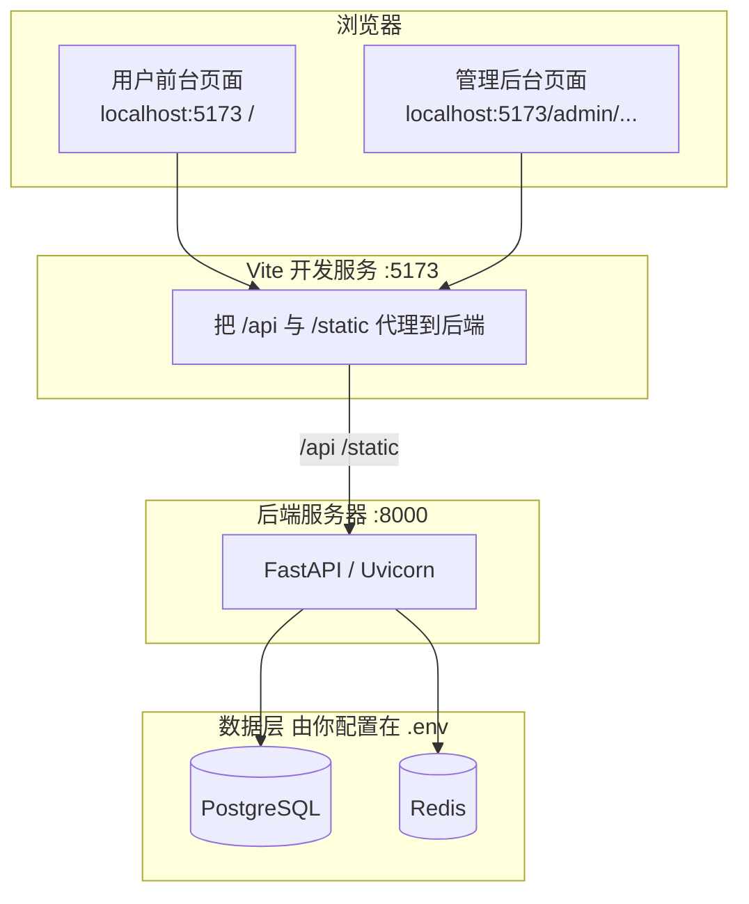

# 架构说明：服务器、数据库、用户前端、管理后台 — 一张表分清

下面四个名字最容易混，**先记住这张表**，再看后面的图与端口。

| 你听到的词 | 在本项目里具体指什么 | 谁在用 / 怎么访问 |
|------------|----------------------|-------------------|
| **服务器（后端）** | 跑 **FastAPI** 的进程，一般用 **Uvicorn** 监听端口 | 开发默认 **`http://127.0.0.1:8000`**。所有业务接口在 **`/api/...`**。只有**后端进程**会按 `DATABASE_URL` 去连 PostgreSQL、按 `REDIS_URL` 连 Redis。 |
| **数据库** | **PostgreSQL**（例如 Supabase 提供的云库） | 存业务数据与后台配置表。地址写在 **`backend/.env` 的 `DATABASE_URL`**。**浏览器和 Vue 从不直连数据库**，只调 `/api`。 |
| **前端（用户前台）** | 给**普通用户**用的网页界面 | **同一套 Vue 工程**，路由是 `/`、`/choose-style`、`/result/...` 等（**没有** `/admin` 前缀）。开发时 **`http://localhost:5173`**。 |
| **后台管理的前端** | 给**运营/管理员**用的界面 | **仍是同一套 Vue 工程**，路由统一在 **`/admin` 下**（如 `/admin/config`）。需要左侧填**管理口令**（与 `ADMIN_PASSWORD` 一致），请求带 **`X-Admin-Token`**。 |

**一句话关系**：用户点浏览器 → 只跟 **5173 上的 Vue** 说话；Vue 通过 **`/api`** 跟 **8000 上的后端** 说话；**只有后端**跟 **PostgreSQL / Redis** 说话。

---

## 请求怎么走（开发环境）

- **前台与管理后台**：都是 **一个前端项目、两个路由区域**（`/` 与 `/admin`），不是两个独立网站。
- **「服务器」**：在开发机语境里 = **本机跑的 Uvicorn**；上线后 = 云主机/VPS 上跑的同一套 API 进程。

---

## 端口与代理（开发时必须对齐）

| 地址 | 角色 |
|------|------|
| `http://localhost:5173` | 用户前台 + 管理后台 **页面**都由这里打开。 |
| `http://127.0.0.1:8000` | **API 本体**；浏览器里一般不直接打开，而是通过 5173 **代理**访问 `/api`。 |
| `VITE_API_PROXY_TARGET`（见 `frontend/.env.development`） | 告诉 Vite：把 `/api` 转到哪里，默认 **`http://127.0.0.1:8000`**。 |

---

## 数据库与 Redis（配置在哪里）

| 变量 | 作用 |
|------|------|
| `DATABASE_URL` | 后端连 **PostgreSQL** 的 URI（云库或自建）。 |
| `REDIS_URL` | 后端连 **Redis**（队列、部分缓存）。 |

均在 **`backend/.env`**（及可选仓库根 `.env`）中配置；**修改后需重启 Uvicorn**。

---

## 环境变量：和「四个东西」的对应

| 变量 | 对应关系 |
|------|----------|
| `DATABASE_URL` / `REDIS_URL` | 只服务 **后端 → 数据库/Redis**，与 Vue 无直接关系。 |
| `ADMIN_PASSWORD` | 只用于校验 **管理后台** 调 `/api/admin/...` 时的口令。 |
| `PUBLIC_BASE_URL` | 后端生成对外链接时用的 **API 根地址**。 |
| `FRONTEND_URL` | 后端认为 **用户前台站点** 的根地址（回跳等）。 |

本地开发常见：`PUBLIC_BASE_URL=http://localhost:8000`，`FRONTEND_URL=http://localhost:5173`。

---

## 健康检查（确认后端 ↔ 库）

在跑 API 的机器上（无需管理口令）：

- `GET /health` — 进程是否存活  
- `GET /health/db` — `DATABASE_URL` 能否连上 PostgreSQL  
- `GET /health/redis` — `REDIS_URL` 能否连上 Redis  

---

## 仓库里和「四件事」相关的文件

| 路径 | 说明 |
|------|------|
| `backend/.env` | 后端连库、Redis、管理口令等；**改完重启 API**。 |
| `backend/app/main.py` | FastAPI 应用入口。 |
| `frontend/vite.config.ts` | 开发时 `/api` → 后端。 |
| `frontend/src/router/index.ts` | **`/` 系路由 = 用户前台**，**`/admin` 系 = 管理后台**。 |

---

## 常见误解

| 误解 | 事实 |
|------|------|
| 「管理后台是另一个前端项目」 | **不是**，与用户在同一个 Vue 仓库里，只是路由在 `/admin`。 |
| 「前端 `.env` 里要配 DATABASE_URL」 | **不需要**；数据库只给后端用。 |
| 「服务器 = 数据库」 | **不是**；服务器这里指 **跑 API 的进程/机器**；数据库是 **PostgreSQL 服务**（往往在云上另一处）。 |

---

*上线时：前端多为 `npm run build` 静态资源 + Nginx；API 单独部署；`FRONTEND_URL` / `PUBLIC_BASE_URL` 换成真实域名即可。*
